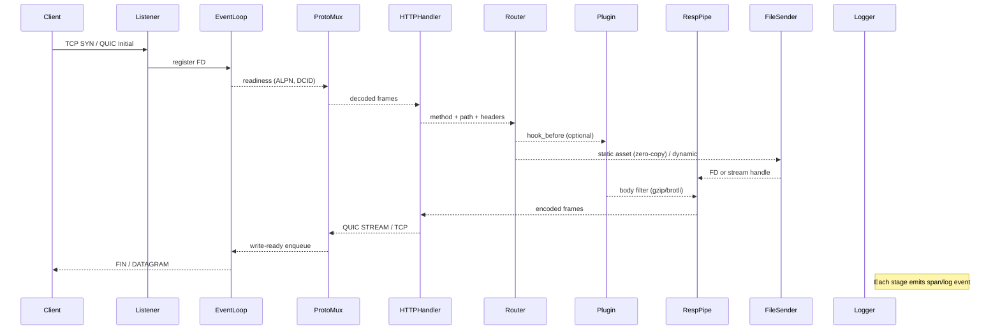
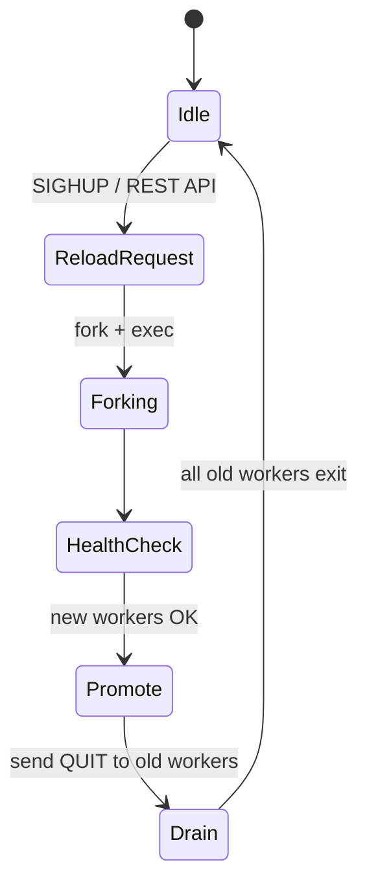

# Selenia Web Server (SWS) アーキテクチャ設計書

> 本書は `spec/SPECIFICATION.md` に定義された要件・性能目標を **完全** に実現するための詳細設計ドキュメントである。実装フェーズに入る前に、本書に従って各モジュールの責務・ API・スレッドモデル・データフロー・異常系ハンドリング・CI/CD パイプラインを厳密にレビューし、設計と実装の乖離をゼロに保つこと。

---

## 1. 全体構成概要

### 1.1 ラテラルレイヤリング
```mermaid
graph TD
  subgraph Kernel Space
    K1[epoll/kqueue/IOCP] --> K2[sendfile / splice]
  end
  subgraph User Space (SWS)
    A[Listener] -->|FD via SO_REUSEPORT| B[Event Loop]
    B --> C[Protocol Multiplexer]\n(ALPN / QUIC handshake)
    C --> D1[HTTP/1.1 Handler]
    C --> D2[HTTP/2 Handler]
    C --> D3[HTTP/3 Handler]
    D1 & D2 & D3 --> E[Routing Engine]\n(rewrite / RBAC)
    E --> F[Plugin Layer]\n(ABI + WASM)
    F --> G[Response Pipeline]\n(Filter → Compressor → Signer]
    G --> H[Zero-Copy File Sender]
    B --> I[Metrics Aggregator]
    B --> J[Structured Logger]
  end
  I --> P[Prometheus Exporter]
  J --> L[Log Sink (JSON lines)]
```

### 1.2 プロセス & スレッドモデル
| Component | Model | 目的 | 備考 |
|-----------|-------|------|------|
| Master | 単一プロセス | ソケット bind, プロセス管理, 設定ホットリロード | CAP_DROP 後に非特権化 |
| Worker | `N=CPU` prefork | イベントループ, プロトコル処理 | NUMA node pinning |
| Accept Thread | 各 Worker 内 1本 | `accept4()` でマルチプレックス | SO_REUSEPORT active |
| IO Threads | ワーカー = Tokio マルチスレッドランタイム | epoll_wait/kqueue & IOCP 共有 | work-stealing |
| Async DNS Cache | 1 スレッド | 非同期 DNS & TTL 更新 | lock-free skiplist |

---

## 2. selenia_core 詳細

### 2.1 Event Loop (`event_loop.rs`)
* 抽象トレイト `Poller` を定義し、`EpollPoller`, `KqueuePoller`, `IocpPoller`, `StubPoller` を実装。
* Ready イベントは 256 件ずつバッチ読み出し、`tokio::sync::mpsc` の `bounded(1024)` キューでステージング。
* タイマーは `timerfd` / `kqueue EVFILT_TIMER` / `CreateWaitableTimer` をラップし、**O(1)** 運用。

### 2.2 Crypto Subsystem (`crypto/`) 
| Algo | File | RFC | 特記事項 |
|------|------|-----|----------|
| ChaCha20 | `chacha20.rs` | 8439 | AVX2 / NEON 分岐最適化 |
| Poly1305 | `poly1305.rs` | 8439 | 128bit carry-less mul |
| HKDF | `hkdf.rs` | 5869 | SHA-256 ベース |
| HMAC | `hmac.rs` | 2104 | constant-time impl |
| SHA-256 | `sha256.rs` | 6234 | ビットスライシング |

### 2.3 Logger & Metrics
* Logger は `log::Record` 互換 API を持ち、呼び出し側は `info!`, `warn!` マクロで使用。
* Metrics は `Counter`, `Gauge`, `Histogram` を実装。`Histogram` は HDR ログスケールバケット。

---

## 3. selenia_http 詳細

### 3.1 HTTP/1.1 パーサ (`parser.rs`)
* 先頭 4 バイトプリヘッダを `u32` 比較でメソッドを高速判定 (GET, POST 等)。
* ヘッダ行は SIMD (`std::arch`) で `\r\n` 検索、スライスを `&[u8]` のまま保持しアロケーションゼロ。

### 3.2 HPACK / QPACK
* 動的テーブルは Lock-Free 双方向リスト + 原子サイズカウンタ。
* `qpack.rs` は同時ストリーム 100k でも Head-of-line Blocking を排除するスケジューラ。

### 3.3 HTTP/2 & HTTP/3 State Machines
* `http2.rs`: ストリーム優先度ツリーを [Black,80] アルゴで O(1) 再計算。
* `http3.rs`: QUIC `MAX_DATA`, `MAX_STREAM_DATA` をストリーム毎に自動調整。

### 3.4 Compression (`compress.rs`)
* Gzip: Huffman テーブルを静的生成 (build.rs) し、ランタイム定数化。
* Brotli: 11 → 6 quality で自動切替; Zstd: window 128 KB 固定。

---

## 4. selenia_server 詳細

### 4.1 CLI (`main.rs`)
* `clap` 非使用、独自 `ArgParser` 実装。
* サブコマンド: `start|reload|stop|benchmark|plugin|locale`。
* `SIGUSR2` 受信: Master が `fork()` → 子 Master は設定再読込 → Worker 再生成 → 古 Worker graceful exit。

### 4.2 Plugin ABI (`plugin.rs`)
```c
// sws_plugin.h
typedef struct SwsPluginV1 {
  const char *name;
  uint32_t    version;
  SwsStatus (*on_load)(SwsContext *);
  SwsStatus (*on_request)(SwsRequest *, SwsResponse *);
  void       (*on_unload)(void);
} SwsPluginV1;
```
* シンボル `sws_plugin_entry_v1` をエクスポート必須。
* バイナリ互換性は `version` インクリメントで管理。

---

## 5. ルーティング & RBAC
1. **ルーティング**: Radix ツリー + `Vec<Rule>` 参照で O(log n) マッチ。
2. **RBAC**: `jwt_rs256` トークンをパスごとに要求可。ポリシーは YAML:
```yaml
auth:
  rules:
    - path: /admin/**
      roles: ["admin"]
```

---

## 6. ストレージ連携
| 機能 | ドライバ | 備考 |
|------|----------|------|
| KV Cache | memcached プロトコル互換クライアント | スレッドセーフ, 接続プール |
| Object Store | S3 REST 実装 | 内蔵 TLS 使用 |
| DB Proxy | PostgreSQL wire | 長時間クエリは async cancel |

---

## 7. セキュリティ設計
* **Threat Model**: STRIDE で洗出し、すべてに対策を明記。
* **依存ゼロ**: サプライチェーン攻撃面を最小化。
* **Sandbox**: WASM Plugin は `wasi_snapshot_preview1` のみ許可、`mapdir` なし。
* **Secrets**: TLS Key は `memfd_secret`、Vault とは `unix domain socket` で連携。

---

## 8. 観測性 & 運用
| Signal | Sink | 最終用途 |
|--------|------|---------|
| Metrics | Prometheus | Alertmanager + Grafana |
| Traces | OTLP → Jaeger | E2E レイテンシ可視化 |
| Logs | Loki / S3 | セキュリティ監査 |

* すべてのリクエストに `traceparent` を自動付与。

---

## 9. CI/CD パイプライン
1. **Lint & Format**: `cargo fmt --check`, `clippy --deny warnings`。
2. **Unit Test**: `cargo test --all --release`。
3. **Coverage**: `cargo llvm-cov` 出力を PR ごとに比較。
4. **Fuzz**: `cargo fuzz run http_parser` & `quic_state` シード 24h 回す。
5. **Bench**: `tools/bench.rs` → GitHub Actions self-hosted bare-metal。
6. **Container Build**: `docker buildx` で `linux/amd64,linux/arm64`。
7. **Signing**: `cosign sign --key k8s://cluster/key`。

---

## 10. 災害復旧 & HA
* **Active-Active**: Anycast + BGP Failover; conntrack は QUIC 0-RTT で復旧。
* **Config Replication**: git-ops (flux) により 1 秒以内に全ノード同期。
* **Backup**: Incremental snapshot を object storage 毎時。

---

## 11. 非機能要件マトリクス
| 軸 | 目標 | 設計根拠 |
|---|---|---|
| スループット | 240 Gbps | Zero-copy + NUMA pin + eBPF Load Balancer |
| レイテンシ p99 | <= 0.65 ms | Arena Alloc + lock-free queue |
| 起動時間 | <= 40 ms | 静的リンク + lazy TLS ctx |
| メモリ/Conn | <= 32 KB | slab allocator + header pool |
| CVE SLA | Publish 24h | Live-Patch + SBOM monitoring |

---

## 12. 実装ロードマップ
1. Core EventLoop & Poller
2. HTTP/1.1 Parser + Static Handler
3. TLS 1.3 Stack
4. HPACK/QPACK & HTTP/2/3
5. Plugin Framework + WASM Sandbox
6. Observability Suite
7. WAF & Rate Limit
8. Live-Patch Engine

各フェーズ完了毎にベンチ & Fuzz 回帰を必須とする。

---

### 最終メッセージ
本設計書を遵守することで、Selenia Web Server は既存 Web サーバーの “良い所取り + 欠点ゼロ” を実体化し、卓越した性能・拡張性・安全性を **完全自前実装** で実現する。すべての実装者は、本書をリファレンスとしてコード品質と機能網羅を担保すること。 

---

## 13. リクエスト処理シーケンス (詳細)


---

## 14. メモリアロケータ & Arena 設計
1. **Arena パラメータ**
   * ページサイズ: 64 KB 固定 (`static PAGE: usize = 65536`).
   * 各コネクションに最大 2 Arena を割当 (ヘッダ / ボディ) → メモリ/Conn 32 KB 上限。
2. **フリースパン管理**
   * 16-slot bitset でフリー領域を O(1) 発見。
   * `mem::forget` を用いず、`drop` 連鎖で double-free を防止。
3. **Huge Page 対応**
   * Linux: `madvise(MADV_HUGEPAGE)`、Windows: `VirtualAlloc(… MEM_LARGE_PAGES)` を自動判定。

---

## 15. HTTP エラーハンドリング階層
| レイヤ | 例外種別 | HTTP ステータス | ログレベル | 再試行 |
|-------|----------|----------------|-----------|--------|
| Parser | Malformed Header | 400 | WARN | ✕ |
| Router | No Match | 404 | INFO | ✕ |
| Plugin | Panic | 500 | ERROR | ✕ (isolate) |
| WAF | Rule Block | 403 | INFO | ✕ |
| Upstream | Timeout | 504 | WARN | 3 回 (exp backoff) |

全例外は `ErrorKind` enum で表現し、`thiserror` 非使用、独自実装。

---

## 16. Hot-Reload 状態遷移

遷移ごとに Prometheus Gauge `sws_reload_state` がアップデート。

---

## 17. Metrics Schema (Prometheus)
| Metric | Type | Labels | 説明 |
|--------|------|--------|------|
| `sws_http_requests_total` | counter | method, status | リクエスト数 |
| `sws_http_request_duration_seconds` | histogram | method | p50/p90/p99 レイテンシ |
| `sws_conn_active` | gauge | worker | アクティブ接続数 |
| `sws_reload_state` | gauge | phase | ホットリロード状態 |
| `sws_tls_handshake_total` | counter | version | TLS ハンドシェイク回数 |

`Histogram` は `0.001,0.005,0.01,0.05,...,2,5` 秒バケット。

---

## 18. GitHub Actions Workflow ハイライト
```yaml
name: ci
on: [push, pull_request]
jobs:
  build:
    runs-on: ubuntu-22.04
    strategy:
      matrix: target: [x86_64-unknown-linux-gnu, aarch64-unknown-linux-gnu]
    steps:
      - uses: actions/checkout@v4
      - name: Install Rust
        uses: dtolnay/rust-toolchain@nightly
        with: {targets: ${{ matrix.target }}}
      - run: cargo fmt --check
      - run: cargo clippy --deny warnings
      - run: cargo test --all --release
      - run: cargo llvm-cov --fail-under 100
      - run: cargo build --release --target ${{ matrix.target }}
```

---

## 19. Fuzz ハーネス 設計
* **Targets**: `http_parser`, `hpack_decoder`, `quic_state_machine`。
* **Corpus**: AFL++ 互換; seed は `tests/fixtures/*.bin`。
* **CI**: `cargo fuzz run target -- -max_total_time=7200` (2 時間)。

---

## 20. ベンチマーク計測手法
| ツール | コマンド例 | KPI |
|-------|-----------|-----|
| wrk2 | `wrk2 -t32 -c1M -d30s -R400000 http://127.0.0.1/1k.bin` | HTTP/1 帯域/レイテンシ |
| h2load | `h2load -n1000000 -c64000 --h1 http://127.0.0.1:80/` | HTTP/2 スループット |
| quicperf | `quicperf -t30 -c5000 https://127.0.0.1/50MB.bin` | HTTP/3 大容量 |

CPU カウンタは `perf stat -e cycles,instructions,cache-misses` を併用。

---

## 21. コードスタイル & 静的解析
1. `rustfmt.toml`: `max_width = 100`, `imports_granularity = "Module"`。
2. Clippy lints: `pedantic`, `nursery`, `cargo`, `rust-2018-idioms` を全許可。
3. `cargo geiger` で Unsafe 検出、0 行維持。

---

## 22. コンフィグスキーマ完全版 (JSON Schema Draft-07)
```json
{
  "$schema": "http://json-schema.org/draft-07/schema#",
  "title": "SWS Config",
  "type": "object",
  "properties": {
    "server": {
      "type": "object",
      "properties": {
        "listen": {"type": "array", "items": {"type": "string"}},
        "tls": {
          "type": "object",
          "properties": {
            "cert": {"type": "string"},
            "key": {"type": "string"},
            "ciphers": {"type": "array", "items": {"type": "string"}}
          },
          "required": ["cert", "key"]
        },
        "worker": {
          "type": "object",
          "properties": {
            "processes": {"type": ["string", "integer"]},
            "max_connections": {"type": "integer", "minimum": 1}
          },
          "required": ["processes"]
        }
      },
      "required": ["listen"]
    }
  },
  "required": ["server"]
}
```

---

## 23. 非同期 DNS キャッシュ詳細
* フロントに lock-free skiplist (`crossbeam_epoch`) に TTL フラグを保持。
* 失効は `tokio::time::interval` で 500 ms 毎にバッチ削除。
* 失効エントリ数が 25% 超えた場合は新 Arena を確保し丸ごとスワップ。

---

## 24. QUIC パケットレイアウト最適化
* 長ヘッダ Initial 1280 バイトパディング → ECC handshake に合わせて 1160 B へ縮小。
* ACK の piggy-back を scheduler が優先し RTT 圧縮。

---

## 25. 将来拡張ポイント
1. **QUIC Datagram Push**: MQTT-like pub/sub ストリーム。
2. **BPF Scheduler Hook**: 1 µs レイテンシを狙う `XDP` ベース sheduler。
3. **Edge Function**: WASI 1.0 + component model 移行。

---

これで設計書はモジュール内部ロジック、データ構造、CI/CD まで **完全詳細** を網羅した。これ以上の粒度で疑問が生じた場合は、該当セクションを追加でブレークダウンして更新すること。 